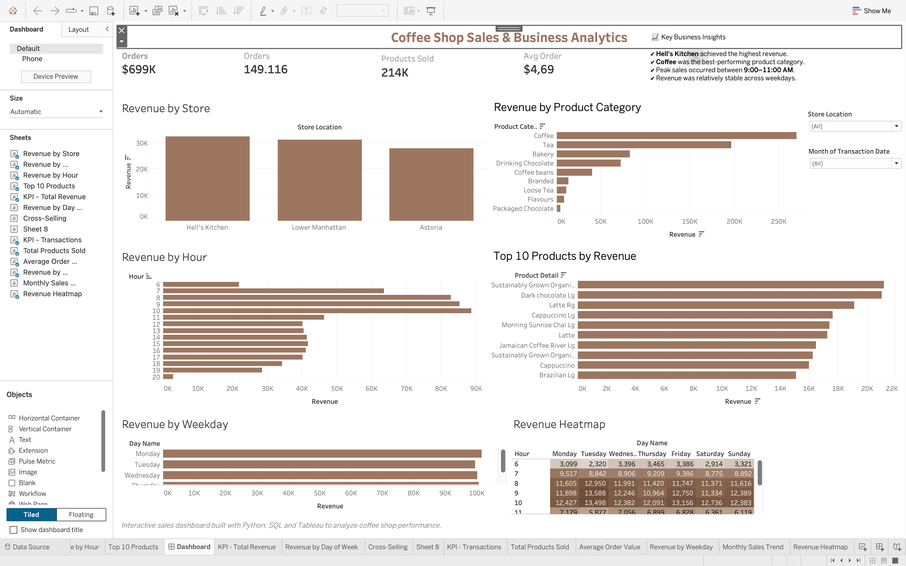

# Coffee Shop Business Analytics

End-to-end sales analysis of a three-location coffee shop chain — from raw
transaction data to SQL-driven insights and an interactive Tableau dashboard.

## 📊 Interactive Dashboard

**[View Dashboard on Tableau Public →](https://public.tableau.com/views/CoffeeShopSalesBusinessAnalytics/RevenuebyStore)**



## Overview

This project analyzes 149,116 point-of-sale transactions across three New
York coffee shop locations (Hell's Kitchen, Lower Manhattan, Astoria) over
six months (January–June 2023). The goal was to go beyond a single chart and
build a full analytics workflow: explore the data with Python and SQL, and
surface the findings in a dashboard a store manager could actually use.

**Key findings:**

- Hell's Kitchen generated the highest revenue of the three locations
- Coffee is the best-performing product category, ahead of tea and bakery
- Sales peak in the 9:00–11:00 AM window
- Revenue is relatively stable across weekdays, with no single day dominating

## Repository Structure

```text
coffee-shop-business-analytics/
│
├── dashboard/
│   ├── coffee_shop_sales.twbx
│   └── dashboard.png
│
├── data/
│   ├── Coffee Shop Sales.xlsx
│   └── coffee_shop_cleaned.csv
│
├── notebooks/
│   └── coffee_shop_analysis.ipynb
│
├── sql/
│   ├── product_analysis.sql
│   ├── sales_kpis.sql
│   ├── sales_trends.sql
│   ├── store_analysis.sql
│   ├── store_category_analysis.sql
│   ├── store_performance.sql
│   └── top_products.sql
